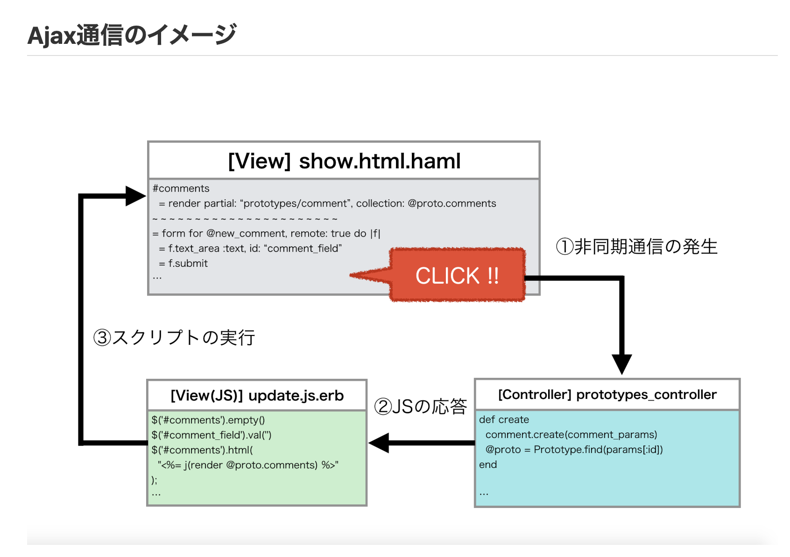

## 参考記事


#### remote: true

- [ ] <a href="https://qiita.com/__tambo__/items/409ccf256e84017ea307">Ajax(非同期通信)についてわかりやすさ重視でまとめてみた(Rails使用のデモ付)</a>
  - [ ] <a href="https://qiita.com/__tambo__/items/45211df065e0c037d032">Railsで remote: true と js.erbを使って簡単にAjax(非同期通信)を実装しよう！(いいね機能のデモ付)</a>

#### Rails tutorial

- [ ] <a href="https://railsguides.jp/working_with_javascript_in_rails.html">Rails で JavaScript を使用する</a><br>


#### JSONP
- [ ] <a href="https://blog.ohgaki.net/stop-using-jsonp">JSONPは危険なので禁止</a><br>


#### Ajax初心者目線

- [ ] <a href="https://qiita.com/nekoneko-wanwan/items/bedc0e826c0842ca0b11">はじめてajaxを使うときに知りたかったこと</a><br>
- [ ] <a href="https://qiita.com/hisamura333/items/e3ea6ae549eb09b7efb9">初心者目線でAjaxの説明</a><br>
- [ ] <a href="https://qiita.com/fezrestia/items/e669107a4a6e66618738">Rails 5.x標準で Ajax+(jQuery+Partial) でHTML部分更新する世界一シンプルなサンプル</a><br>
- [ ] <a href="https://qiita.com/katsunory/items/9bf9ee49ee5c08bf2b3d">JavascriptのAjaxについての基本まとめ</a>
- [ ] <a href="https://qiita.com/mihou/items/0fbda161527fcec48e81">[Rails] Ajax通信を用いたカテゴリボックス作成</a>
- [ ] <a href="https://qiita.com/Yama-to/items/377f8a92cf30a3ebf454">モモンガでも使えるAjax（えいじゃっくす） − 投稿したコメントをリロードせずに表示しよう</a>


Ajaxまとめ


## 目次

0 同期と非同期とは
1. Ajaxとは
2. Ajax通信の必要条件
3. JSONとは
4. JSONPとは
5. rails-ujsとは

●. 実際にAjaxを使ってみた


## 0 同期と非同期とは 

#### 同期通信の場合
webブラウザからサーバーにリクエストを通信し、レスポンスが戻ってくる。<br>
この時に全ての情報を通信しているので一瞬画面が白くなる<br>
=>サーバーからレスポンスが返ってくるまで他の作業はできない

#### 非同期通信の場合
webブラウザから一部の情報をリクエストするので、
それ以外の部分は変わらない、なので面白がることはない。<br>
=>サーバーからレスポンスが返ってこなくても他の作業はできる<br>
一部の情報をサーバーに送信してそれを受け取り反映させる仕組みをAjaxという


## 1 Ajaxとは

Ajaxごは、Asynchronous JavaScript + XML の略称でJavaScriptを使って非同期でサーバーとやりとりをする通信のことです。<br>


* クライアントから非同期更新に必要なデータをサーバーに送る<br>
* サーバーはデータを受け取ってクライアントに整形済データを返す<br>
* クライアントはサーバから受け取った整形済データをDOMに反映する<br>


ざっくりこのような流れでAjaxは実現されてる。<br>
クライアントからデータを送ったり、サーバから整形済データが返ってきたと検知するところにJavascriptのXTR(XMLHttpRequest)という技術が使われていて、<br>
返って来たと検知するところにJavaScriptのXTR(XMLHttpRequest)という技術が使われていて、返ってくる整形済データがXMlだったりするので Asynchronous JavaScript + XML と呼ばれている。<br>
ただし、XMLは名前だけ残って良いて、デファクトスタンダートで返ってくるデータはJSONというフォーマットが多いい。





1.非同期通信の発生
<br>
* 上記のようにフォームにAjaxを導入した時は,submitボタンを押した時に「非同期通信を行いなさい」という指令がControllerに飛びます。


2.JSの応答
<br>
* 非同期通信を行うように指令を受けたControllerは指定のアクションを実行し、そのあとテンプレートファイルを読み込みにかかります。
* 通常ここでフォーマットを指定しない限りHTMLファイルが読み込まれますが、「非同期通信を行いなさい」と指定されたControllerはHTMLファイルを読み込まずアクション名と対応したJSファイルを読み込みにかかります。
* `update`アクションを実行したのであれば対応するJSファイルは`update.js.erb`です。


3.スクリプトの実行
<br>
* JSファイルが読み込まれると中に記述してあるスクリプトを実行し、一連の処理は終了します。
* このスクリプトに「ビューの中のこの部分をこのように変更しなさい」という指示を織り込むことで、ページリロードせずともページ内の一部表示が再描画されるのです。


<br>
<br>


## 2, Ajax通信の必要条件


* formにremote属性がセットされていること
* 対応するアクションが存在すること
* 対応するJSファイルが存在すること


## 3, JSONとは

`
json   # データ記法 
jsonp  # コールバック関数
`

JSONはJavaScript Object Notationの略で、<a href="http://pentan.info/doc/rfc/j4627.html">RFC4627が規定するデータ記述言語です</a><br>
その名が示す通り、JavaScriotの記法でデータを記述できる点が最大の特徴です。語法はJavaScriptですが、そのシンプルさから多くの言語がライブラリを用意しているためa<br>
プログラミング言語間でデータを受け渡せます。<br>


WebサービスではブラウザがJavaScriptを実行できるので相性が良いこと、XMLと比べてデータ表現の冗長性が低いことなどかの利点から<br>
Ajax通信に置けるデータフォーマットとして活用されます、


### メディアタイプ

JSONのメディアタイプは「application/json」です。<br>
以下のHTTPヘッダは、このメッセージのボディがUTF-8でエンコードしたJSONであることを意味します。
` Content-Type: application/json; charset=utf-8`

 XMLやHTMLと同様に特別な理由がない限りはUTF-8を使うのが無難です。
 

 
### データ型
 
 JSONに組み込みで用意されてるデータ型には次の6つがあります。<br>
 
 
 * オブジェクト
 * 配列
 * 数値
 * ブーリアン
 * null
 


#### オブジェクト
 
```
{
  "name": {
     "first": "Yohei",
     "last": "Yamamoto"
  },
  "blog": "http://yohei-y.blogspot.com",
  "age": 34,
  "interest": ["Web", "XML", "REST"]
}
```

オブジェクトは`{`で始まり、`}`で終わります<br>
メンバは`,`で区切り、メンバの名前と値は`:`で区切ります。<br>
この例は、name,blog,age,interestの4つのメンバをもつオブジェクトです<br>
メンバはそれぞれ順に、オブジェクト、文字列、数値、配列を値として持っています.


<br>

#### クロスドメイン通信の制限

JSONPを説明する前に、なぜJSONPが必要になるのかの背景をせつめい<br>

Ajaxで用いるXMLHttpRequest という JavaScriptのモジュールはセキュリティ上の制限からJavaScriptファイルを取得したのと同じサーバとしか通信できません<br>
JavaScriptが在るサーバとは別のサーバと通信できてしまうと、ブラウザで入力した情報をユーザが知らない間に不正なサーバに送信できてしまうからです。<br>
ちなみに、このように不特定多数のドメインに属するサーバにアクセスすることを「クロスドメイン通信」(ドメインをまたがった通信の意）と呼びます<br>
<br>
<br>
しかし、複数のドメインのサーバと通信できず、単一のドメインのみと通信をしなければならないのは大きな制限です。<br>
たとえば、自サービスでは地図データと郵便番号データを保持せずに、それらを提供している他のWeb API( Google map, ぐるなびのapiとか)から適宜取得することができないからです。<br>


##  4, JSONPとは
<br>
JSONP (JSON with padding)とは、scriptタグを使用してクロスドメインな(異なるドメインに存在する)データを取得する仕組みのことである。<br>
HTMLのscriptタグ、JavaScript(関数),JSONを組み合わせて実現される。<br>
<br>
<br>


XHRだとサイト間をまたいでデータ共有できない制限を回避するために利用されてきた仕組みです。<br>
<br>


## 5, .rails-ujsとは


現場で使える Ruby on Rails5 速習実践ガイドから引用 P336<br>

先ほどリンクに```remote: true```というオプションを加えるとdata-remote属性が付与され、Ajaxでリクエストが送信されると説明した。<br>
これは「rails-ujs」というActionView添付のJavaScriptライブラリによって処理されています<br>
<a href="https://github.com/sho-kasama/Todo-rails/pull/31">関連issue</a>


* Action Viewとは<br>
Action Controllerのアクションに応じたCRUDアクションの実行後のレスポンスを実際のWebページにまとめる役割を担います<br>
<br>
<br>
rails-ujsはAjaxリクエストを送信するだけでなく、関連するイベントも発行します<br>
このイベントを利用することで、Ajaxの任意のタイミングで柔軟に処理を実行することができる、ここで利用したajax:successもそのイベントの一つで、Ajaxによるレスポンスの成功、つまりタスクの削除が成功した時に実行されます<br>

<br>
<br>
もう少し踏み込むと, ajax:success イベントは,HTTPレスポンスのステータスコードが2XX(成功)の場合に処理されます。それ以外の場合は ajax:error イベントは処理されます。 TasksController#destory アクションでは、削除が成功するとステータスコード204が返されるため、 ajax:success イベントが発生し、ハンドラの処理が実行されることになる<br>


<br>
<br>

ちなみに、rails-ujsが備えている機能はAjaxだけではありません。 link_to メソッドへのオプションとして今まで利用してきたmethod: :delete」によるDELETEリクエストの発行や「data-confirm」による確認ダイアログの表示も実はrails-ujsが担っている。またフォームのsubmitボタンに「data-disabled-with」属性が付与されますが、これもrails-ujsが提供するフォームの二重クリックを防止する機能です。


<br>

### SJR(Server-generated JavaScript Responses)とは？

Railsではサーバーサイドで生成したJavaScriptからなるレスポンス(またはこのレスポンスによる画面更新までのプロセス)のことを、Server-generated JavaScript Responses(SJR)といいます。


## ● 実際にAjaxを使ってみた

- [ ] <a href="https://github.com/sho-kasama/Ajax_/blob/master/README.md">Ajaxを理解するために作成した</a>


