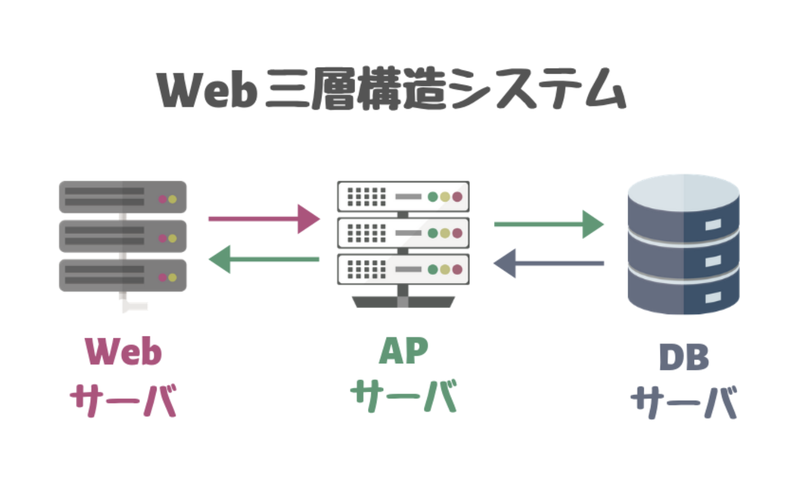
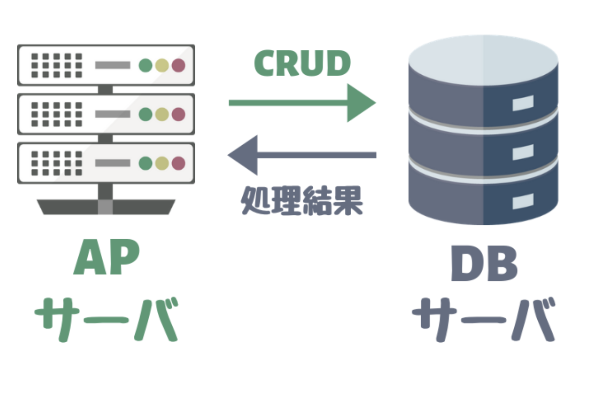

## Webについて

### APサーバ(アプリケーションサーバ)の役割とは？

アプリケーションを実行するためのサーバです。プログラミングして作ったアプリケーションを動かすにはAPサーバが必要です。 
APサーバはWebサーバとDBサーバの間に位置しています。

1. 「Webサーバ」からのリクエスト(要求)を「APサーバ」が受け取る

2. 受け取ったリクエストに応じてアプリケーションを実行する

3. アプリケーションからDBサーバを操作し、その結果を処理に組み込む

4. 実行結果をWebサーバに渡す

 

APサーバは、Webサーバとセットで使うことがほとんど。 
必要であればDBからデータを操作し、データの取得や検索、削除、更新なども行う。 

 
ちなみに、上のようなシステムを「Web三層構造システム」っていう。

 

## APサーバとWebサーバの違い

WebサーバとAPサーバの違いで大きいのは、サーバを単体で使うことができるかどうかというところ。 

 
動的コンテンツのない、静的コンテンツだけのサイトを公開するのであればAPサーバを使わずともWebサーバ単体で実現することができます。 

 
ですが、APサーバはアプリケーションを実行する機能しか持たないため、APサーバを単体で使うケースはほとんどありません。

 

- 動的コンテンツ... 　RubyやPHPなどのプログラム
- 静的コンテンツ...   HTML,画像など

ただし、Webサーバ機能を備えているAPサーバ(PumaやTomcatなど)も存在します。 
 

これは開発をスムーズに行えるよう、簡易的なWebサーバ機能がおまけでついているからです。 
APサーバにあるWebサーバ機能は開発の補助的なものと理解しておきましょう。

### APサーバの種類

APサーバにもいくつかの種類があります。

- Puma(プーマ)
- Unicorn(ユニコーン)
- Apache Tomcat(アパッチ　トムキャット)

## DBサーバとは？

この世にあるWebサイトのほとんどぐあ、DBサーバ(データベースサーバ)を利用しています。 
DBサーバはなければユーザー登録や検索機能などのアプリケーションを開発することができないからです。つまり、Webサイトを作るWebエンジニアにとってDBの知識は必須。

### DBの役割とは？

DBサーバ(データベースサーバ)とは、アプリケーションで利用するデータを格納し操作するためのサーバです。 
もう少し簡単にいうと、DBサーバはデータの倉庫であり、必要なタイミングでデータを出し入れすることができます。

- データの作成(Create)
- データの読み出し(Read)
- データの更新(Update)
- データの削除(Delete)

これらの機能の頭文字をとってCRUD(クラッド)と呼びます。

- 1.APサーバ上のアプリケーションからDBサーバにデータ操作を要求する
- 2.DBサーバは要求された処理を行い結果をAPサーバのアプリケーションに返す

DBサーバはAPサーバからの要求にしたがって処理を実行し、その結果を返すというのが基本的な流れ。

## 参考記事

- <a href="https://kitsune-programming.com/ap-server-summary">APサーバの役割とは?Webサーバとの違いをしっかり理解しよう</a>
- <a href="https://kitsune-programming.com/db-server-summary">DBサーバとは？役割や種類を初心者にもわかりやすく解説!</a>

