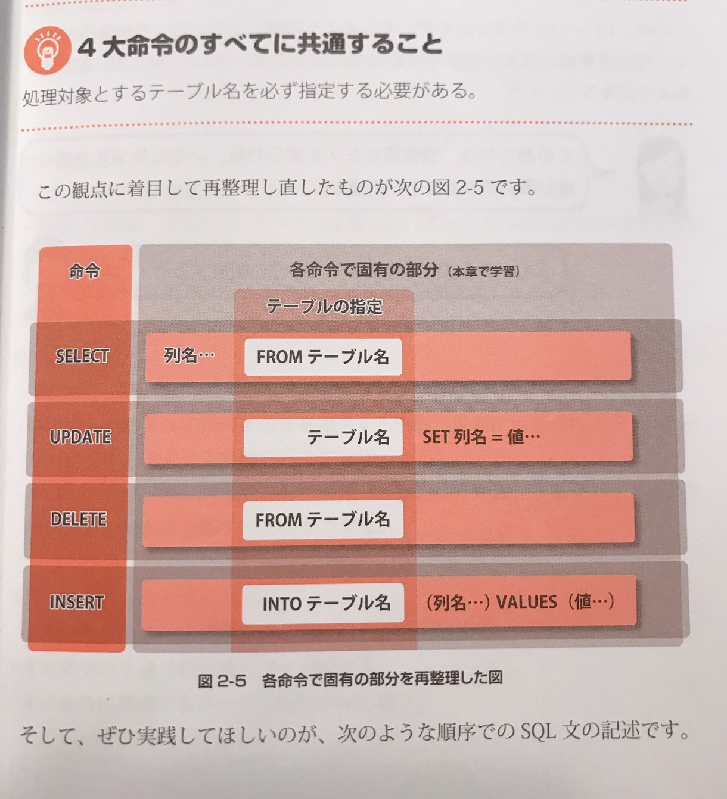

## 4大命令の詳細を書いていく

## SELECT文の基本構文 ( データの検索 )

#### 基本構文

`
SELECT 列名...       ← SELECTは取得しなさい、この列のデータを
FROM テーブル名 　　　 ← このテーブルから
(WHERE修飾)
`

#### ASによる別名の定義

`
SELECT 費目 ITEM, 入金額 AS RECIVE, 出金額 AS PAY
FROM 家計簿 AS MONEYBOOK
WHERE 費目 = '給料'
`

別名をつけるメリット → 結果表に置ける列のタイトルを任意のものに変更できる。わかりにくい列名や長い列名でもわかりやすい列名をつけて利用することができる・

 
 

## UPDATE文( データの更新 )

UPDSTE文じゃすでにテーブルに存在するデータを書き換えるための命令です。

`
UPDATE テーブル名　← 更新しなさい、このテーブルの情報を
SET 列名1 = 値1, 列名2 = 値2..... ← この列をこのデータで
(WHERE修飾)
`

UPDATEの直後には、更新したいデータの存在するテーブル名を記述します。二行目をSET句といい、更新したい列名とその列に書き込むデータを記述します。 
*　WHEREのないUPDATE文は全件更新します。

 
 

## DELETE文 ( データの削除 )

#### 基本構文

`
DELETE 　← 削除しなさい
FROM テーブル名 ← このテーブルの情報を
(WHERE修飾)
`

* WHEREで対象行を指定しないDELETE文は全データを削除する

## INSERT文 ( データの追加 )

#### INSERT文の基本構文

INSERT文は、テーブルに新しいデータを追加するための命令です。これまでに紹介した3つの命令とは異なり、テーブルの行を指定する仕組み(WHERE)はない。 
その代わりに、どこに、どのようなデータを追加するのかを指定する構造になっている 

`
INSERT INTO テーブル名  ← このテーブルに ( 列名1, 列名2, 列名3 .....) ←　この列に
VALUES ( 値1, 値2, 値3....) ←　このデータを
`

 
 
 

## 4大命令をスッキリ学ぶ3つのコツ

1, 4大命令の構造と修飾語の全体像をしっかり把握する
2, 4大命令の2通りの分類方法を理解する
3, 4大命令に共通するテーブル指定を先に書く

### 4大命令の分類方法 ( 検索系と更新系 )

検索系: SELECT  
更新系: UPDATE, DELETE, INSERT 

 

検索系の命令はデータベースのデータを書き換えることはありません。また、SQLの実行結果は表の形になります。 
一方、更新系の命令はデータベースのデータを書き換えることが仕事です。実行結果は「成功か失敗か」であり、表などが返されることはありません。 
 
このことを頭に入れておくと、たとえば「ORDER BY」という修飾語を使うことで検索結果の表の行を並び替えることができます。

### 4大命令の分類方法 ( 既存系と新規系 )

既存系: SELECT, UPDATE, DELETE 
新規系: INSERT 

 

既存系の命令は、すでにデータベースに存在するデータに対して何らかの処理を行うためのものです。 
一方、新規系の命令はまだデータベースに存在しないデータについての指定をします。

 
上の図のWHERE句が使われている処理をみてください。INSERT文は既存のデータに対する処理なのでWHERE句の利用はできません。

 
 
 

## 4大命令の全てに共通すること

