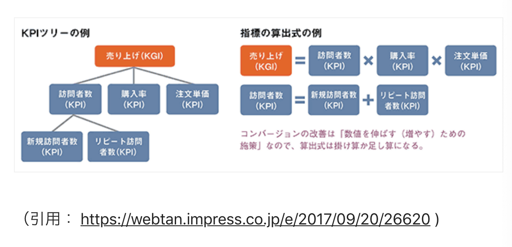

## 1. KGI

事業部全体会議で行く言葉！大きい目標って感じのイメージ。

<b>Key Goal Indicator</b>の略。<b>重要目標達成指標</b>という意味です。 
売上高、成約数、利益率とかが当てはまるらしい。事業部達成目標的なやつ。

## 2. KPI

これもよく聞く。その改善のKPIってなんだっけみたいに聞かれる。

<b>Key Performance Indicator</b>の略。<b>重要業績評価指標</b>という意味。 
クリック数とかユーザー数とか購入数のことをいう。

よく言われるのが、KGIと何が違うの？ってところだけど、KGIが最終ゴールだとしたらその途中の経過ポイントみたいなイメージです。 
KPIは過程、KGIは結果をみる指標らしい。

## 3.CV

「コンバージョンしないな、、、、」とよく聞きますが。

これは<b>Conversion</b>の略。サービスやサイトにおけるユーザーの最終的な<b>成果</b>のこと

具体的に言うと、<b>購入やユーザー登録、入会</b>などを指します。 
通販サイトにきたユーザーが購入したことを1コンバージョンというみたいな感じ。

## 4.CVR

「<b>コンバージョンレイト</b>が悪くって〜、ジーアイアールが悪くって〜」ってマーケのお兄さんが言うらしい。

Conversion Rateの略。(なんでCRちゃうねんって思う私も思う。)<b>コンバージョン率</b>という意味。 

率なのでもちろん計算式がある。

例えば、<b>購入数/サイト訪問者数</b>とか、<b>クリック数/LP訪問者数</b>とか。 
分母も分子も結構柔軟に変わる。CVRの改善のためのWebページ改修とかよく聞く。

## 5.imp

<b>インプ</b>って読む。<b>インプレッション</b>の方がよく言うと思う。

impressionの略。<b>広告の掲載回数のこと</b>

- [ ] <a href="https://note.mu/yuzooho/n/n4eb0a81c5fc7">参考記事</a>

## 6.CTR

<b>Click Through Rate</b>の略。<b>クリック率</b>や<b>クリックスルー率</b>という意味。

CTRっていうより、クリック率っていう方が多い気がする。<b>クリック数/imp</b>で出せる。

## 7.UU

GA(Google Analytics)とか使うことになったら、死んでも絶対聞く単語。

<b>Unique User</b>の略。<b>ユニークユーザ数</b>という意味。

決まった期間内にサイトにきた<b>ユーザー数</b>を表します。
ただし、<b>同じユーザーが何回来てもそれは1カウントとされます。</b>

同じユーザーがどうかは<b>クッキー</b>とか<b>IPアドレス</b>で判定されるっぽい。

